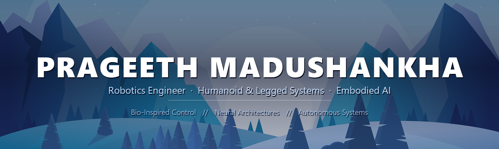

  

  

  
  
  
  

 

> **I build robots that stay upright.** Humanoid and legged locomotion, whole body
> control and model predictive control, down to the firmware on the microcontroller.
> Based in Kotte, Sri Lanka, and available for freelance work.

### Currently

- Taking freelance robotics and embedded work on [Fiverr](https://www.fiverr.com/s/YRGqkLq)

### Selected Work

| Project | What it does | Stack |
| :--- | :--- | :--- |
| **[Bipedal Walking and Push Recovery](https://github.com/PrageethM1702/Bipedal-Walking-and-Push-Recovery)** | A 12-DoF biped walks 1.2 m and stays upright under 25 N shoves from any direction, using capture-point balance control, a support-polygon margin, ankle/hip/stepping strategies and analytic leg IK. | `Python · PyBullet · Control` |
| **[HRNS-Q: Hybrid Robotic Nervous System](https://github.com/PrageethM1702/HRNSQ---Hybrid_Robotic_Nervous_System_for_Quadrupeds-)** | Low-level reflex circuits paired with high-level AI cognition to study adaptive locomotion in quadruped robots. | `Python · CPG · Reinforcement Learning` |
| **[Spine MRI Viewer](https://github.com/PrageethM1702/Spine-MRI-Viewer)** | Interactive medical imaging platform for multi-vendor MRI dataset exploration and cohort-level analysis. | `Python · Medical Imaging` |
| **[4 kV Ion Thruster for CubeSats](https://github.com/PrageethM1702/Ion-Thruster)** | Design and simulation of a plasma-based ionic thruster, accelerating charged ions electrostatically for continuous low-thrust deep-space propulsion. | `Simulation · Space Systems` |

### Core Stack

**Languages**

  
  
  
  
  
  
  
  

**Robotics & Simulation**

  
  
  
  
  
  

**Embedded & Hardware**

  
  
  
  
  
  

**Design, Analysis & ML**

  
  
  
  

### About

I work on robotics and intelligent systems, mainly AI, embedded systems and
spacecraft related engineering. I like getting my hands dirty building things
and making them actually work in the real world instead of keeping everything
in theory.

Most of my time goes into learning, testing ideas and figuring out how to make
systems smarter, more efficient and more reliable. I enjoy both the small
details and the bigger picture, from electronics and control to how everything
comes together as a full system.

I am really into advanced system design and how intelligent machines can improve
over time. For me it is not just about doing projects, it is about understanding
things deeply and using that to build something meaningful.

Always happy to connect with people who are into robotics, AI, aerospace or just
building cool and ambitious stuff 😁

### Metrics

<!-- Self-hosted cards, refreshed daily by .github/workflows/stats.yml.
     The public github-readme-stats instance is paused and serves 503. -->

  
  

  

  

<!-- Animated contribution snake, rendered by .github/workflows/snake.yml -->

  

 

